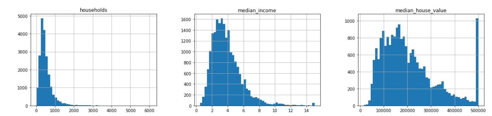
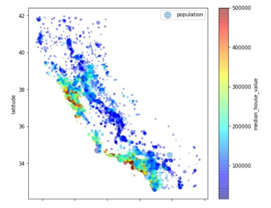
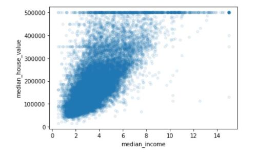

# Housing-prices-in-Califonia
In this repository work on building a machine learning model that uses Califonia census data which has attributes like; Population, median income, median house value, longitude, latitude for each small district in the region.
The model will use this data to learn and be able to predict the median housing price of any district give the other attributes.

Before going deeper into building models, I first downloaded the [Dataset]( https://raw.githubusercontent.com/ageron/handson-ml2/master/datasets/housing/housing.tgz), explore and visualize it to gain insights. This helps in cleaning up attributes that maynot be relevant for the machine learning models.

Below we see the entries.

Below I further plot some graphs to visualize the data.

To further gain more insights, I plot the latitude and longitudes data on a scatter plot which generated a map of Califonia. I added some visualization parameters to make patterns stand out in median_house_value attribute and population attribute. As expected, its seen that the housing prices are very much correlated to the location e.g close to the sea and to the population density. With more red spots indicating areas where the house value is high while the bigger bubbles showing areas where the population is high.

Since the goal is to predict the median house value, to identify the most important attributes that will help to achieve this I explore the correlation between each attribute and the median_house_value attribute. I discovered a inear correlation with the median_income attribute. Below is a scatter plot for the two attributes.

